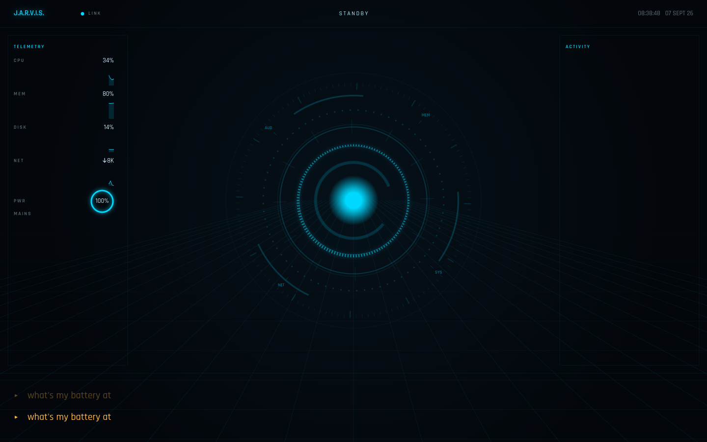

# JARVIS

An always-listening voice assistant for your Mac. Say "Hey JARVIS," it answers
in a British voice with dry understatement, actually operates your machine —
apps, windows, music, messages, calendar, files, shell — and renders itself as
a full-screen holographic HUD while it's at it.

Two halves, cleanly separated: a headless voice/agent core that works with the
HUD switched off, and a HUD that's just a view fed by a WebSocket — kill it and
JARVIS keeps talking.



## Quickstart

You'll need a Mac (Apple Silicon recommended), [Homebrew](https://brew.sh),
Python 3.11+, and either a [Claude Code](https://claude.com/claude-code) login
or an `ANTHROPIC_API_KEY`.

New to the Terminal, Homebrew, or Python? Start with
[MAC-SETUP.md](MAC-SETUP.md) — it walks through installing all three from
scratch, then sends you back here.

```bash
git clone https://github.com/quirkbyte/jarvis.git
cd jarvis
make install   # venv, brew deps, python deps, the wake-word model
make doctor    # checks this Mac and names the fix for anything missing
make run       # the assistant, listening for "Hey JARVIS"
```

If `make run` refuses to start with "JARVIS can't reach Claude yet," you need
one of the two things below — pick whichever applies to you.

### Connecting Claude

JARVIS needs a way to actually talk to Claude. Two options; you only need one.

**Option 1 — Claude Code login** (use this if you already pay for Claude Pro
or Max):

```bash
curl -fsSL https://claude.ai/install.sh | bash   # installs the Claude Code CLI
claude                                            # opens a browser to log in
```

Sign in with your Claude.ai account when the browser opens. Once you see
"Login successful," JARVIS will reuse that login automatically — nothing
else to configure. **This only works with a paid Claude Pro or Max plan** —
a free Claude.ai account won't work here.

**Option 2 — An API key** (use this if you don't have Claude Pro/Max, or
would rather pay only for what JARVIS actually uses):

1. Go to [console.anthropic.com](https://console.anthropic.com), sign up,
   and create an API key.
2. Copy `.env.example` to `.env` (if you haven't already) and add the line:
   ```
   ANTHROPIC_API_KEY=sk-ant-...
   ```
3. That's it — `make run` will pick it up automatically.

Either way, run `make doctor` afterward to confirm it's recognized — look
for `anthropic auth` in the output.

No microphone handy, or just want to see it work first?

```bash
make text      # talk to it by typing, no mic required
make hud       # open the running HUD in Chrome, app mode
```

Optional: an [ElevenLabs](https://elevenlabs.io) API key gets you a noticeably
better voice than the built-in `say -v Daniel` fallback. Copy `.env.example`
to `.env` and fill in what you want to change — every setting is documented
there, and nothing in it is required to get started. Once you have a key, run
`make voices` to audition British voices and pick one automatically.

## What it can do

- Wakes on "Hey JARVIS" and answers fast — sub-300ms from wake to response start
  is the budget it's held to.
- Runs real tools on your Mac: opens apps, controls music and volume, reads
  your calendar, drafts (and, after you confirm, sends) messages, checks
  system stats, finds files, searches the web, sets timers.
- Remembers things you tell it to remember, across restarts.
- Interruptible — say "Hey JARVIS" again mid-answer and it stops instantly and
  listens.
- A cinematic full-screen HUD: a reactive arc-reactor core, live waveform,
  system telemetry, transcript.

🎨 Want more looks? **[See all the skins](https://quirkbyte.github.io/jarvis/skin-board.html)**
— ten more HUD worlds (Minecraft, Roblox, Fortnite, Cyberpunk, Geometry Dash)
sold separately, real captures of each one animating.

## How it's built

- **Core**: async Python. Wake word (`openwakeword`) → speech-to-text →
  [Claude Agent SDK](https://docs.claude.com/en/api/agent-sdk/overview) with
  tools → text-to-speech (ElevenLabs, or macOS `say` offline).
- **HUD**: vanilla JS + Canvas/DOM, no build step, no bundler — it's a static
  page fed over a local WebSocket. Open `jarvis/hud/static/index.html`'s
  served copy in any browser once the core is running.
- **Persona**: JARVIS's entire character lives in one file,
  [`reference/persona.md`](reference/persona.md) — edit it to change how he
  talks, not the code.

## Useful commands

| Command | What it does |
|---|---|
| `make install` | venv, brew deps, python deps, wake-word model |
| `make doctor` | checks this Mac and names the fix for anything missing |
| `make run` | the assistant |
| `make text` | text mode, no microphone |
| `make hud` | open the running HUD in Chrome, app mode |
| `make test` | run the test suite |
| `make voices` | audition British ElevenLabs voices and pick one |
| `make stop` | stop a running instance |

Run `make help` for the full list.

## Configuration

Every tunable lives in `jarvis/config.py` and is overridable via environment
variable (`JARVIS_<SECTION>_<FIELD>`, or a handful of shorter aliases —
see `.env.example`). Run `python -m jarvis --config` to print the fully
resolved config tree. State (memory, logs) lives in `~/.jarvis`, deliberately
outside the repo.

## License

MIT — see [LICENSE](LICENSE).
